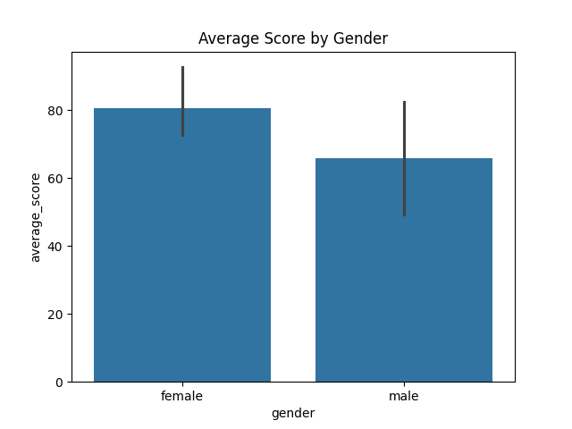
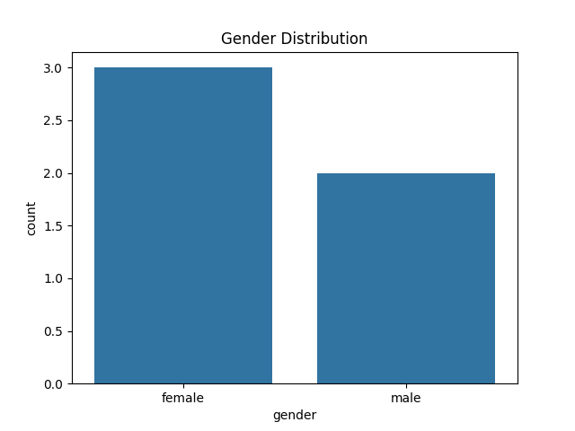

# 🎓 Student Performance Analysis

This project analyzes student performance data using Python. It focuses on understanding how various factors such as gender, test preparation, and parental education level affect student scores in math, reading, and writing.

## 📊 Dataset

The dataset used is **StudentsPerformance.csv** which contains the following features:
- Gender
- Race/Ethnicity
- Parental level of education
- Lunch
- Test preparation course
- Math score
- Reading score
- Writing score

## 🛠️ Tools Used
- Python 🐍
- Pandas 📦
- Matplotlib 📈
- Seaborn 🎨
- Visual Studio Code 💻
- GitHub 🌐

## 🔍 Analysis Performed

- Basic Data Exploration
- Null and Data Type Checks
- Score Distribution Visualization
- Gender-wise Score Comparison
- Correlation Heatmap
- Average Score per Student

## 📈 Sample Visualizations

  


## 🚀 How to Run

1. Clone the repo:
   ```bash
   git clone https://github.com/Ankit280930/student-performance-analysis.git
   cd student-performance-analysis
